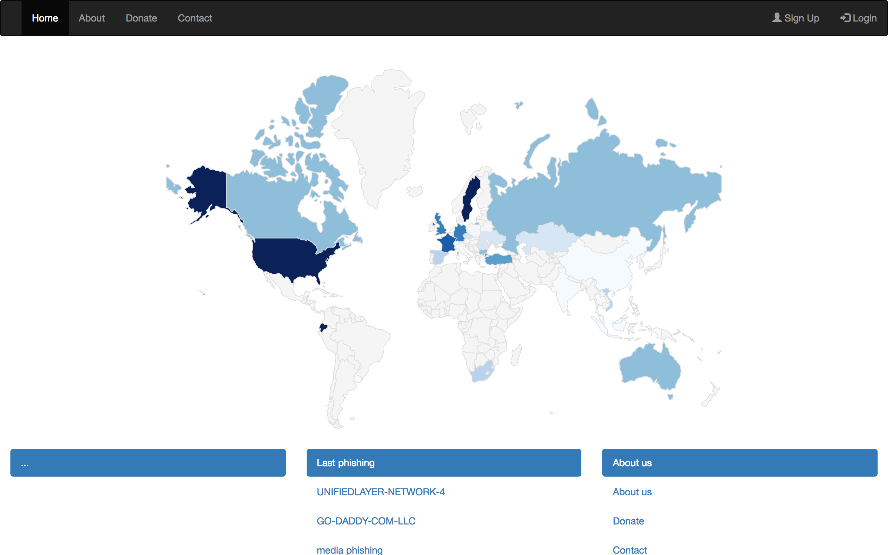

# phishing-tracker
Phishing tracker

Phishing-tracker, is a phishing aggregation system, both at the addresses where they are hosted and after the names in which they are targeted.

#TODO
Please look in doc.google.com (Phishing-tracker)

#ENDPOINTS
# grab new urls from phishtank.com
- http://127.0.0.1:500/phishtank/getall
when it runs, we add new data to Phishtank with staus "new".
Next you have to get details about phishings url

# grab phishing urls from the phishtank.com
http://127.0.0.1:500/phishtank/getandaddone
we add new data to Phishing and Ip and we change status in the Phishtank tale. added = success, error = when we couldn't add new phishing (maybe unique urls ?)

# update details in the Ip databse (we get actually Ip from phishing domain)
http://127.0.0.1:500/phishing/updatephishingip

#grab phishing from cleanmx and add 2 database
http://127.0.0.1:500/cleanmx/getandadd